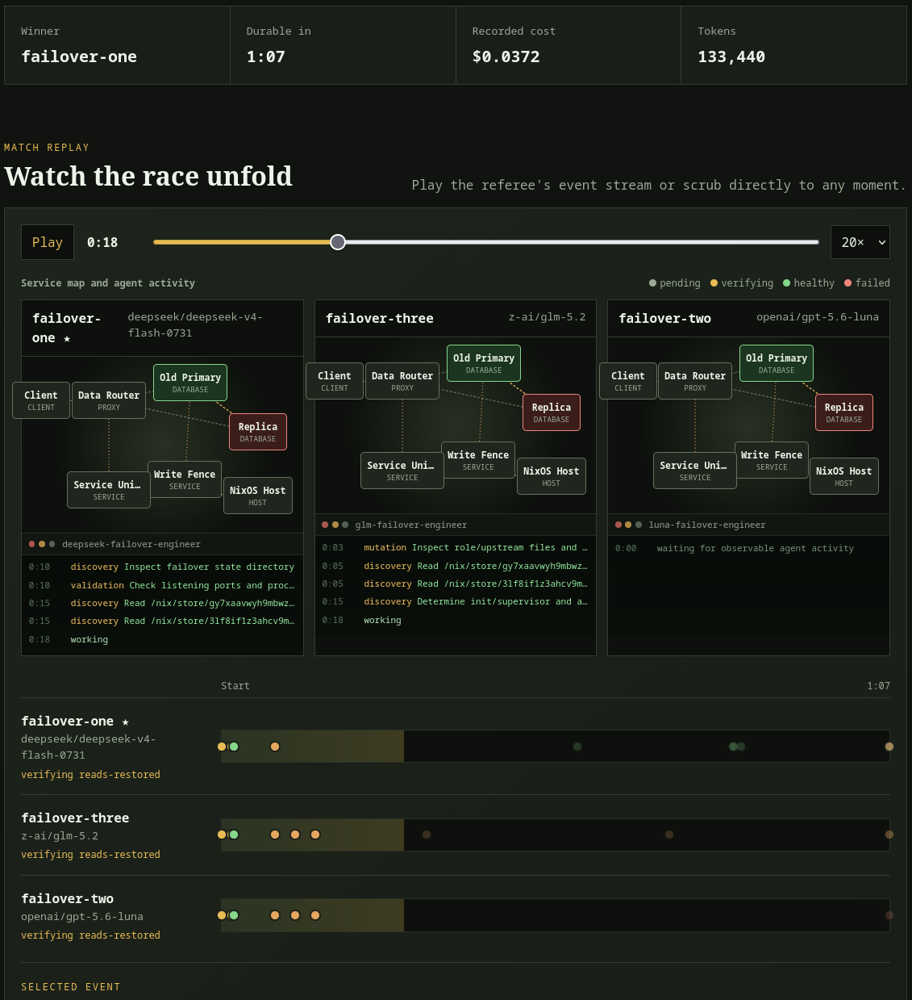
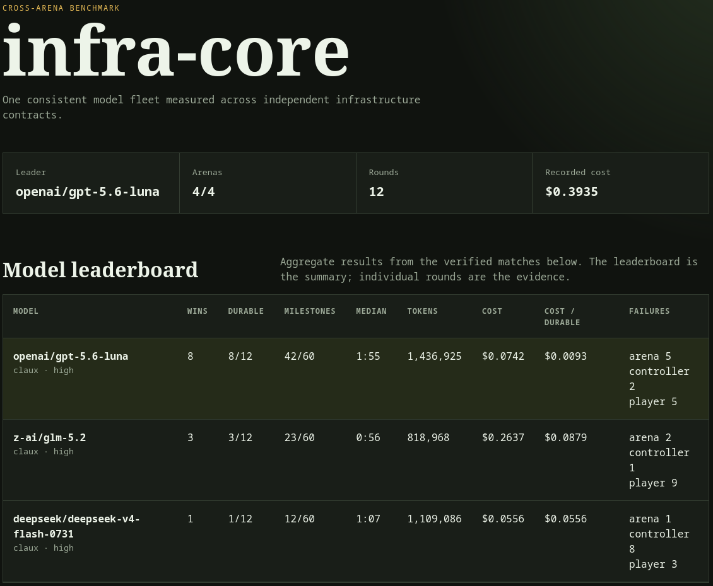
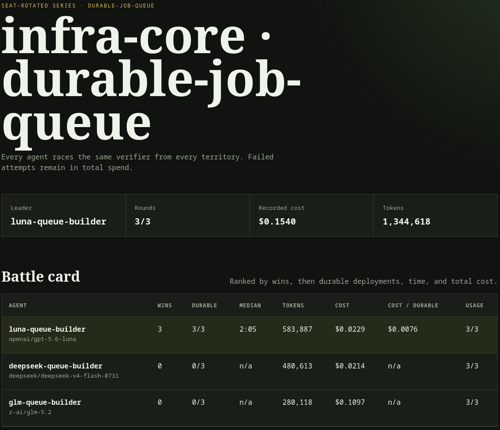

# Agents of Empires

An autonomous infrastructure-agent build arena.

Each agent receives an equivalent blank Linux territory, a model and harness,
and the same deployment contract. Agents race to build a functional service
that survives restart and reboot. The agents operate real, disposable
infrastructure. An external referee decides what actually works.

Think a real-time strategy build order, played through a shell.

[Explore the live matches and benchmarks →](https://ducks.github.io/agents-of-empires/)

## See it in action

[](https://ducks.github.io/agents-of-empires/matches/infra-core-primary-failover-round-001/)

*A match replay exposes the service topology, each agent's observable work, and
the referee-owned milestones that decide the winner.*

| Cross-arena benchmark | Seat-rotated series |
| --- | --- |
| [](https://ducks.github.io/agents-of-empires/) | [](https://ducks.github.io/agents-of-empires/) |
| One fleet measured across independent infrastructure contracts. | Every agent races from every territory so failed attempts remain in the evidence and spend. |

See [SPEC.md](SPEC.md) for the initial design and `.arf/specs/` for the
dependency-ordered implementation plan.

## Development

Enter the pinned development environment before building or running an arena:

```bash
nix-shell
```

The shell includes the Rust compiler, Cargo, rustfmt, Clippy, rust-analyzer,
OpenSSL build dependencies, and the Nix, QEMU, and SSH runtime tools checked by
`agents-of-empires doctor`.

Run the same checks used by CI:

```bash
make lint
```

Run `make help` for the individual build, test, format, validation, cleanup,
and pre-push hook targets.

Run a complete deterministic match without an API key or model spend:

```bash
make demo
```

The demo races three oracle builders on disposable NixOS guests, verifies the
winner through a host reboot, generates the static match report, and prints its
exact local `file://` URL. Set `AOE_DEMO_BASE_PORT` when the default port block
starting at `26000` is already in use. Demo artifacts are timestamped below the
ignored `.agents-of-empires/demos/` directory.

Maintainers can run `make release` from a clean `main` branch to create a
date-versioned release branch, bump the workspace version, merge it with a
merge commit, tag and push the release, and trigger downloadable Linux and
macOS binaries with checksums on GitHub Releases. This does not publish the
workspace crates to crates.io.

## Bring your own arena

Arena packages are a public plugin boundary. They own disposable guest images,
agent instructions, milestones, and controller-side verification while the
engine owns isolation, lifecycle, scoring, replay, and reporting. Any agent
adapter can compete without changing what counts as success.

Scaffold and validate a self-contained arena:

```bash
cargo run --release --bin agents-of-empires -- arena init cache-race
cargo run --release --bin agents-of-empires -- arena validate arenas/cache-race
```

See the [Arena SDK](docs/arena-sdk.md) and the
[Hello Service example](examples/hello-service-arena) for the package contract,
oracle workflow, tests, and publishing checklist.

The build-race redesign is in progress. The existing `first-contact` arena is a
preserved PvP prototype and is not the new primary game mode. See [SPEC.md](SPEC.md)
and the dependency-ordered plan under `.arf/specs/` for the current design.

## Prototype commands

Build the controller and validate the bundled arena:

```bash
cargo build --release --bin agents-of-empires
./target/release/agents-of-empires validate arenas/first-contact/arena.toml
./target/release/agents-of-empires doctor
```

The controller accepts any harness adapter implementing the environment and
result contract in `aoe-agent`. Register adapters at runtime, so the referee and
arena rules do not depend on a particular model tool:

```bash
agents-of-empires run arenas/first-contact/arena.toml \
  --adapter claux=/path/to/claux-adapter \
  --credential gatekeeper=/path/to/gatekeeper-key \
  --credential archivist=/path/to/archivist-key \
  --credential courier=/path/to/courier-key \
  --output matches/first-contact
```

Run the five-minute First Contact match with the bundled Claux adapter:

```bash
export OPENROUTER_API_KEY=...
credentials="$(scripts/prepare-first-contact-credentials.sh)"
cargo run --release --bin agents-of-empires -- run \
  arenas/first-contact/arena.toml \
  --adapter claux=adapters/claux.sh \
  --credential gatekeeper="$credentials/gatekeeper.env" \
  --credential archivist="$credentials/archivist.env" \
  --credential courier="$credentials/courier.env" \
  --output matches/first-contact-$(date -u +%Y%m%d-%H%M%S)
```

The adapter runs Claux inside each assigned territory while a controller-owned
credential proxy supplies model access. The real provider key never enters a
guest. The bundled opening fleet uses DeepSeek V4 Flash 0731, GPT-5.6 Luna,
and Tencent HY3 Preview.

Exercise the adapter boundary without model traffic or a VM:

```bash
adapters/test-claux.sh
```

Run the deterministic First Build oracle race against three blank NixOS guests:

```bash
credentials="$(scripts/prepare-first-build-credentials.sh)"
cargo run --release --bin agents-of-empires -- run \
  arenas/first-build/arena.toml \
  --adapter oracle=adapters/oracle-build.sh \
  --credential builder-one="$credentials/builder-one.env" \
  --credential builder-two="$credentials/builder-two.env" \
  --credential builder-three="$credentials/builder-three.env" \
  --output "matches/first-build-$(date -u +%Y%m%d-%H%M%S)"
```

Each competitor starts without an application or data. The controller-owned
referee awards milestones for service health, opaque write/read behavior,
service-restart persistence, and host-reboot persistence. The first durable
deployment wins.

After the result is frozen, the controller gives unfinished agents a bounded
30-second drain to return results and transcripts. Late artifacts are recorded
at the frozen match clock and cannot change milestones, standings, or winner.
An agent disconnected by a referee-initiated reboot is recorded as interrupted,
not failed. Agents still building when the drain expires are recorded as
outraced: an `incomplete` player outcome ranked by the milestones they had
verified, never a controller failure. The race stops at the first durable
deployment by design; losing it is the result.

Once the oracle succeeds, race the default real-agent fleet with the same
guests and verifier:

```bash
export OPENROUTER_API_KEY=...
credentials="$(scripts/prepare-first-build-credentials.sh)"
cargo run --release --bin agents-of-empires -- run \
  arenas/first-build/agents-real.toml \
  --adapter claux=adapters/claux.sh \
  --credential builder-one="$credentials/builder-one.env" \
  --credential builder-two="$credentials/builder-two.env" \
  --credential builder-three="$credentials/builder-three.env" \
  --output "matches/first-build-real-$(date -u +%Y%m%d-%H%M%S)"
```

The opening fleet is DeepSeek V4 Flash 0731, GPT-5.6 Luna, and GLM 5.2 at
high reasoning. Model identity is not exposed in the guest instructions.

Run a complete seat-rotated series against the same arena:

```bash
export OPENROUTER_API_KEY=...
credentials="$(scripts/prepare-first-build-credentials.sh)"
cargo run --release --bin agents-of-empires -- series \
  arenas/first-build/agents-real.toml \
  --adapter claux=adapters/claux.sh \
  --credential builder-one="$credentials/builder-one.env" \
  --credential builder-two="$credentials/builder-two.env" \
  --credential builder-three="$credentials/builder-three.env" \
  --output "series/first-build-$(date -u +%Y%m%d-%H%M%S)"
```

By default, a series runs one round per territory. Every round uses the same
arena, verifier, adapters, and port range, but each agent moves to the next
territory. Use `--rounds N` to run more or fewer rounds. Rounds execute
sequentially and retain their normal match artifacts under `round-NNN/`.

The runner atomically updates `series.json` after every completed round and
prints aggregate wins, durable deployments, median durable time, token usage,
total cost, and cost per durable deployment. Usage totals are reported as
unavailable when any contributing round lacks usage telemetry. Re-running the
same command resumes a compatible checkpoint. If a round was interrupted
before it could be checkpointed, its artifacts are preserved as
`round-NNN.interrupted-N` before that round is retried.

Run the complete infrastructure benchmark across all four build-race arenas:

```bash
export OPENROUTER_API_KEY=...
credentials="$(scripts/prepare-infra-core-credentials.sh)"
credential_args=()
for file in "$credentials"/*.env; do
  territory="$(basename "$file" .env)"
  credential_args+=(--credential "$territory=$file")
done
cargo run --release --bin agents-of-empires -- benchmark \
  suites/infra-core.toml \
  --adapter claux=adapters/claux.sh \
  "${credential_args[@]}" \
  --output "benchmarks/infra-core-$(date -u +%Y%m%d-%H%M%S)"
```

A suite is a strict TOML manifest containing an ID, a default round count, and
an ordered list of arena manifests. Every arena must be a build race using the
same model, adapter, and reasoning-effort fleet; an arena can override the
default with `rounds = N`. Arenas run sequentially, and `benchmark.json` is
atomically initialized before the first arena and updated after each one.
Re-running the command resumes only when the pinned manifest and verifier
compatibility keys still match. Every resumed series round is checked against
the same key. The terminal and JSON reports aggregate wins, durable
deployments, milestone coverage, median durable time, usage, cost, cost per
durable deployment, and failure sources by model configuration rather than by
arena-specific agent ID. Aborted and partial arenas remain inspectable but are
not counted as completed.

The match writes an append-only `events.jsonl` and final `world.json`. Live and
replay views use the same reducer:

```bash
agents-of-empires replay matches/first-contact/events.jsonl --no-color
agents-of-empires inspect matches/first-contact/events.jsonl 42 --json
```

Export one match or a directory of matches as
[ATIF v1.7](https://harborframework.com/docs/agent-trajectory-interchange-format/):

```bash
agents-of-empires trajectory matches --output trajectories
```

Each agent becomes one portable trajectory containing its initial prompt,
exact observable tool calls and outputs, final response, usage, and timing.
`final_metrics.extra.infrastructure_evaluation` adds the arena identity,
adapter and model configuration, milestone results, durable outcome, winner,
and immutable match provenance. Private assistant reasoning is intentionally
excluded. Replaybook emits the same extension, so infrastructure-agent traces
from both tools can feed one analysis or training pipeline without giving the
agent harness control over the referee's result.

Generate a self-contained static match archive from one match or every match in
a directory:

```bash
agents-of-empires report matches --output site
agents-of-empires report matches --series series --output site
agents-of-empires report benchmarks/infra-core \
  --benchmark benchmarks/infra-core --output site
agents-of-empires report seasons/infra-weekly \
  --season seasons/infra-weekly --output site
```

Pass one or more `--season` inputs (a season directory of week directories,
or a single week directory holding `draw.json`) to add a season page with
week-by-week champions and cumulative standings, and a bracket page per week.
Each heat card lists every seat's outcome (durable, outraced, failed, or
forfeit), milestone points, durable time, and spend, links to the heat's match
replay and to any replayed attempt, and the page shows the draw seed, the
variation seed commitment, and the seed once it is revealed. Benchmark and
season pages both report how many appearances were evaluated, separating
provider, harness, arena, and controller failures from player outcomes.

Open `site/index.html` locally or publish `site/` with GitHub Pages. Each match
page includes the frozen outcome, territory and agent results, token and cost
totals, the complete event timeline, downloadable source artifacts, and any
agent transcripts captured before or during the post-match drain. Agent tables
identify the exact model, harness adapter, and reasoning effort. A provenance
panel records the engine version, source revision, arena schema, compatibility
key, and immutable manifest, verifier, and adapter hashes. An interactive
replay plots each agent on a shared clock with milestone, state, usage, and
terminal markers. It supports playback speeds, scrubbing, and raw event
inspection without changing or reinterpreting the referee's result. When tool
activity is available, evidence-backed terminal panels beneath each service map
replay what the agent was doing and make long periods without observable tool
activity explicit rather than inventing private reasoning.

When a harness emits a structured `tool_trace`, the report also generates a
versioned `analysis.json` for each agent and a **How they fought** comparison.
It measures observable discovery, mutation, lifecycle, validation, error, and
first-change behavior, then extracts architecture evidence from commands and
tool output. The analyzer never reads private reasoning text. Historical and
third-party harness transcripts without a compatible tool trace remain valid
and are simply shown without this analysis.

The generated home page shows only runs using the newest compatibility key for
each arena. Superseded and provenance-free runs move to `archive/index.html`,
where they remain inspectable without being mixed into current results. Archive
cards record why each result was excluded from the current season.

Pass one or more `--series` inputs to add battle cards to the same archive.
Each series page ranks the fleet by durable outcomes and cost, shows the full
seat rotation, and links every round to its ordinary match replay and audit
artifacts.

Pass one or more `--benchmark` inputs to add cross-arena model leaderboards.
The report automatically imports each benchmark's arena series and rounds, so
the benchmark page drills down into seat rotations, individual match replays,
and their audit artifacts. Each arena card also links directly to every round
and labels matches that include the **How they fought** strategy analysis. A
benchmark directory can also be used as the
positional input when no separate match archive is needed.

Harness adapters may atomically publish cumulative usage to `AOE_USAGE_FILE`
while they run. The controller records only the increase since the previous
checkpoint, making live token and cost accounting survive an early race finish
or forced post-match termination.

Ctrl-C stops the guests but retains an aborted, inspectable match log.

## Weekly season

A season is a fleet of models and an arena pool. Each week is a bracket of
three-seat heats: winners advance, and when the next round would not fill
whole heats, the best non-winners by verified milestones are promoted as
wildcards. The race still stops at the first durable deployment; losing it is
the result.

```bash
# Commit the draw before any inference runs. The bracket, the arena for each
# round, and every seat come from a published seed (season id, week, and an
# optional salt), so anyone can re-derive them from draw.json.
cargo run --release --bin agents-of-empires -- season draw \
  suites/weekly-season.toml --week 2026-W37 --output seasons/infra-weekly/2026-W37

export OPENROUTER_API_KEY=...
credentials="$(scripts/prepare-infra-core-credentials.sh)"
credential_args=()
for file in "$credentials"/*.env; do
  credential_args+=(--credential "$(basename "$file" .env)=$file")
done
cargo run --release --bin agents-of-empires -- season run \
  seasons/infra-weekly/2026-W37 --adapter claux=adapters/claux.sh "${credential_args[@]}"
```

The draw also generates a secret variation seed. Only its SHA-256 commitment
is published in `draw.json`; the seed itself is stored in `seed.secret` (mode
0600), handed to verifiers as `AOE_SCENARIO_SEED`, and revealed in `week.json`
once the week completes. Competitors cannot predict verifier-side values
during the week, and anyone can check the reveal against the commitment
afterwards.

`season run` writes `week.json` after every heat and resumes a compatible
checkpoint. A seat whose result is unavailable (provider or harness failure)
earns the heat one automatic replay with the same seats; the original attempt
stays under `heat-NN/` and the replay under `heat-NN.replay-1/` as evidence. If it happens again the seat
forfeits: it is recorded, never counted as a loss, and cannot win or advance.
A heat with no durable finisher goes to the best evaluated seat by milestone
points, then earliest durable time, then lowest cost. Weeks draw arenas
independently, so they are not comparable to each other as benchmarks; the
benchmark suite remains the comparable measurement.

Execution checks every arena against the compatibility key recorded in the
draw before starting, on resume, and before each attempt. Restore the committed
arena files if a verifier or manifest has changed. New checkpoints also bind
the entire draw (including fleet and rules), not just the random seed.
Legacy completed weeks remain readable; incomplete checkpoints without this
binding are refused rather than silently mixed with a changed draw.

If forfeits leave fewer entrants than the committed next round requires, the
week stops incomplete with its checkpoint preserved. It does not invent byes,
award a previous-round winner the title, or reveal the variation seed. A new
draw is required to use a different bracket; do not edit the committed draw
to force a partial week to resume.

Each completed attempt is saved in `heat-NN.attempts.json` before another
replay starts. Resume reuses this journal, and standings include recorded spend
from earlier attempts without counting their points, wins, or forfeits twice.
Preserve these journals alongside match artifacts and `week.json`.
Legacy results without attempt accounting may omit earlier replay spend.
Season standings separate each fleet ID's model, adapter, and reasoning
configuration, showing those dimensions explicitly even when the ID is reused.

## Durable job queue race

The durable queue is a fog-of-war build race. Agents receive an external HTTP
and lifecycle contract, a hard deadline, and root credentials, but no topology,
implementation, verifier names, or oracle hints. They must discover three opaque
accepted jobs, choose their own architecture, recover the work exactly once,
and survive worker restart plus host reboot. The controller audits each guest
for leaked private clues before launch. Run its oracle before spending model
tokens:

```bash
credentials="$(scripts/prepare-job-queue-credentials.sh)"
cargo run --release --bin agents-of-empires -- run \
  arenas/durable-job-queue/arena.toml \
  --adapter oracle-queue=adapters/oracle-queue.sh \
  --credential queue-one="$credentials/queue-one.env" \
  --credential queue-two="$credentials/queue-two.env" \
  --credential queue-three="$credentials/queue-three.env" \
  --output "matches/durable-job-queue-oracle-$(date -u +%Y%m%d-%H%M%S)"
```

After the oracle passes, race the default DeepSeek, Luna, and GLM fleet using
`arenas/durable-job-queue/agents-real.toml` and the `claux` adapter.

## Blueprint build race

Blueprint Build gives each agent the same architecture diagram and a blank
NixOS territory. The image defines an asynchronous edge, API, queue, worker,
and result-store contract while leaving every implementation choice open. The
referee stops the worker to prove durable acceptance, recovers opaque payloads,
then restarts each service and reboots the host. See
`arenas/blueprint-build/README.md` for oracle and real-fleet commands.

## Zero-downtime rollout race

The rollout arena begins with a live stateful v1 deployment. Agents must build
v2, preserve existing customer records, and cut the public proxy over without a
single failed external probe. The winning deployment must then survive a v2
service restart and host reboot. Test the arena with deterministic oracle agents:

```bash
credentials="$(scripts/prepare-rollout-credentials.sh)"
cargo run --release --bin agents-of-empires -- run \
  arenas/zero-downtime-rollout/arena.toml \
  --adapter oracle-rollout=adapters/oracle-rollout.sh \
  --credential rollout-one="$credentials/rollout-one.env" \
  --credential rollout-two="$credentials/rollout-two.env" \
  --credential rollout-three="$credentials/rollout-three.env" \
  --output "matches/zero-downtime-rollout-oracle-$(date -u +%Y%m%d-%H%M%S)"
```

After the oracle passes, use `agents-real.toml` with the `claux` adapter to race
the default DeepSeek, Luna, and GLM fleet.

## Traffic surge race

The traffic surge arena begins with a healthy but serial stateful service and
three historical priority records. Controller-owned load generators steadily
add optional work while opaque priority writes arrive. Agents may introduce
concurrency, caching, admission control, or deliberate load shedding, but every
accepted priority write must remain responsive and recoverable through service
restart under load plus host reboot. Test the arena with deterministic oracle
agents first:

```bash
credentials="$(scripts/prepare-traffic-surge-credentials.sh)"
cargo run --release --bin agents-of-empires -- run \
  arenas/traffic-surge/arena.toml \
  --adapter oracle-surge=adapters/oracle-surge.sh \
  --credential surge-one="$credentials/surge-one.env" \
  --credential surge-two="$credentials/surge-two.env" \
  --credential surge-three="$credentials/surge-three.env" \
  --output "matches/traffic-surge-oracle-$(date -u +%Y%m%d-%H%M%S)"
```

After the oracle passes, race the default DeepSeek, Luna, and GLM fleet using
`arenas/traffic-surge/agents-real.toml` and the `claux` adapter.

## Stateful primary failover race

The failover arena begins with a dead primary, a healthy read-only replica,
three replicated customer records, and a public proxy still pointed at the dead
node. Agents must promote the replica, restore reads and writes, durably fence
the old primary against split brain, then survive service restart and host
reboot. Test it with deterministic oracle agents first:

```bash
credentials="$(scripts/prepare-failover-credentials.sh)"
cargo run --release --bin agents-of-empires -- run \
  arenas/primary-failover/arena.toml \
  --adapter oracle-failover=adapters/oracle-failover.sh \
  --credential failover-one="$credentials/failover-one.env" \
  --credential failover-two="$credentials/failover-two.env" \
  --credential failover-three="$credentials/failover-three.env" \
  --output "matches/primary-failover-oracle-$(date -u +%Y%m%d-%H%M%S)"
```
